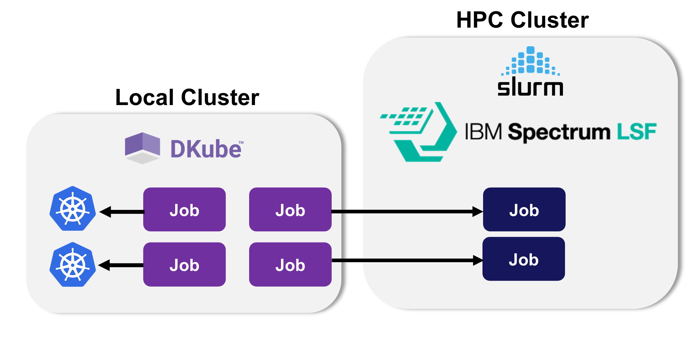

.. include:: Role_Header.txt

.. _dkubex-intro:

DKubeX Overview
#################

.. cssclass:: no-border

:grayback:`This is a sample block diagram to show an image.  Normally, I have put a border around screenshots, but for block diagrams you can use the "no-border" class to prevent it if you want. This would be replaced with a screenshot of the Splashpage or block diagram of the DKubeX pieces.  This also shows how you can use roles to provide background, text color, and other highlights - they are in the custom.css file and some of them are at the top of this file.`

DKubeX\ :super:`TM` is...

* Introduction to what DKubeX is and how it works
* High level summary of it's operation and advantages

  * Not a marketing or sales write-up, but something that clearly spells out what it's used for and what advantages it brings

* Approx a single screen/page
* High level block diagram at the top
* Links to other pages such as the sections on the flows, any tutorials, and the various operations that can be performed
* Mention both the UI & CLI features, with references to the detailed sections

Some examples of formatting
**********************************

:grayback:`These are the admonitions`

.. note:: Something that needs to be highlighted, but is informational in nature
.. important:: Something that should not be overlooked, and is likely to lead to trouble if not followed
.. warning:: This is something that will lead to some serious problem if overlooked or done incorrectly.  It should jump out at the user.

